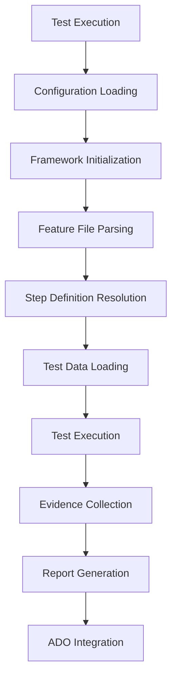

# CS Test Automation Framework - User Guide

This comprehensive guide provides detailed instructions for implementing and using the CS Test Automation Framework with real-world examples from the Akhan application.

## 📋 Table of Contents

1. [Framework Architecture](#framework-architecture)
2. [Project Setup](#project-setup)
3. [Configuration Management](#configuration-management)
4. [Test Implementation](#test-implementation)
5. [Data-Driven Testing](#data-driven-testing)
6. [Advanced Features](#advanced-features)
7. [Best Practices](#best-practices)
8. [Examples](#examples)

## Framework Architecture

### Core Components

```
┌─────────────────────────────────────────────────────────┐
│                 CS Framework Core                       │
├─────────────────────────────────────────────────────────┤
│  🎯 BDD Engine    │  🤖 AI Healing   │  📊 Reporting    │
│  • Gherkin Parser │  • Smart Locators │  • Multi-format  │
│  • Step Registry  │  • Auto Recovery  │  • Analytics     │
│  • Test Runner    │  • Visual AI      │  • Dashboards    │
├─────────────────────────────────────────────────────────┤
│  🌐 UI Testing   │  🔗 API Testing   │  🗄️ DB Testing   │
│  • Page Objects   │  • HTTP Client    │  • SQL Queries   │
│  • Element Cache  │  • Response Val.  │  • Multi-DB      │
│  • Browser Pool   │  • Auth Support   │  • Data Val.     │
├─────────────────────────────────────────────────────────┤
│  📦 Data Layer   │  ⚙️ Config Mgmt   │  🔧 Utilities    │
│  • Multi-format  │  • Hierarchical   │  • Logging       │
│  • Caching       │  • Environment    │  • Encryption    │
│  • Streaming     │  • Validation     │  • Network       │
└─────────────────────────────────────────────────────────┘
```

### Framework Flow



## Project Setup

### 1. Environment Configuration

Create a hierarchical configuration structure for the Akhan project:

```bash
config/
├── global.env                    # Global framework settings
├── akhan/                       # Akhan project configuration
│   ├── project.env              # Project-specific settings
│   ├── common/                  # Shared configurations
│   │   ├── api.endpoints.env    # API endpoint definitions
│   │   ├── database.queries.env # Database query templates
│   │   └── akhan-common.env     # Common application settings
│   └── environments/            # Environment-specific settings
│       ├── dev.env              # Development environment
│       ├── sit.env              # System Integration Testing
│       ├── qa.env               # Quality Assurance
│       └── uat.env              # User Acceptance Testing
```

### 2. Akhan Project Configuration

#### config/akhan/project.env
```bash
# Project Metadata
PROJECT_NAME=AKHAN
PROJECT_CODE=AKH
PROJECT_VERSION=2.1.0
PROJECT_DESCRIPTION=AKHAN Application Test Automation Suite

# Default Browser Configuration
DEFAULT_BROWSER=chromium
DEFAULT_HEADLESS=false
DEFAULT_VIEWPORT_WIDTH=1920
DEFAULT_VIEWPORT_HEIGHT=1080

# Test Configuration
DEFAULT_TIMEOUT=30000
DEFAULT_RETRY_COUNT=2
DEFAULT_PARALLEL_WORKERS=1

# Reporting Configuration
REPORT_TITLE=AKHAN Test Execution Report
REPORT_LOGO_URL=https://company.com/logo.png
REPORT_COMPANY=MyCompany Ltd.
```

#### config/akhan/environments/dev.env
```bash
# AKHAN Development Environment Configuration

# Application URLs
AKHAN_SIT_URL=https://akhan-ui-sit.myshare.net/
AKHAN_API_URL=https://api-dev.akhan.com
AKHAN_ADMIN_URL=https://admin-dev.akhan.com

# Test Accounts
ADMIN_USERNAME=admin@akhan.com
ADMIN_PASSWORD=AdminPass@2024
STANDARD_USER=testuser@akhan.com
STANDARD_PASSWORD=TestPass@2024

# Database Configuration
AKHAN_DB_HOST=dev-db.akhan.com
AKHAN_DB_PORT=1433
AKHAN_DB_NAME=AKHAN_DEV
AKHAN_DB_USERNAME=akhan_test_user
AKHAN_DB_PASSWORD=DevDbPass@2024
AKHAN_DB_SCHEMA=dbo

# API Configuration
API_BASE_URL=https://api-dev.akhan.com
API_VERSION=v1
API_TIMEOUT=30000
API_RETRY_ATTEMPTS=3

# Feature Flags
ENABLE_SCREENSHOTS=true
ENABLE_VIDEO_RECORDING=false
ENABLE_TRACING=true
ENABLE_PERFORMANCE_MONITORING=true

# ADO Integration
ADO_ORGANIZATION=mdakhan
ADO_PROJECT=akhan-project
ADO_TEST_PLAN_ID=500
ADO_TEST_SUITE_ID=501
ADO_INTEGRATION_ENABLED=true
```

## Test Implementation

### 1. Feature Files with Real Examples

#### test/akhan/features/akhan-esss-search.feature
```gherkin
@TestCase:504 @ADO_TestSuite:500
@DataProvider(source="test/akhan/data/akhan-test-data.json",type="json",filter="executeTest=true,priority=high")
Feature: AKHAN ESSS/Series Search
  As a financial analyst using AKHAN
  I want to search for ESSS/Series information
  So that I can analyze specific financial instruments

  Background:
    Given I navigate to the AKHAN application
    When I enter username "login" and password "passwd"
    And I click on Log On link
    Then I should be logged in successfully
    And I navigate to "ESSS/Series" module

  @regression @TestCase:504 @TC504 @smoke @high
  @DataProvider(source="test/akhan/data/akhan-test-data.json",type="json",jsonPath="$.esss_search_scenarios[?(@.testId=='TC504')]",filter="executeTest=true")
  Scenario Outline: Search ESSS by Key using JSON data
    Given I am logged in to AKHAN application
    And I am on the ESSS/Series page
    When I select search type "<searchType>"
    And I select search attribute "<searchAttribute>" 
    And I enter search value "<searchValue>"
    And I click on the Search button
    Then I should see the search results
    And the search results should contain "<searchValue>"
    And I verify the result count is greater than 0
    And I capture screenshot with name "esss_search_results"

    Examples:
      | searchType | searchAttribute | searchValue |

  @regression @performance
  Scenario: Verify ESSS search performance
    Given I am on the ESSS/Series page
    When I perform search for "MESA 2001-5"
    Then the search should complete within 3000 milliseconds
    And the page should be responsive
```

### 2. Advanced Page Object Implementation

#### test/akhan/pages/ESSSDashboardPage.ts
```typescript
import { CSBasePage } from '../../../src/core/pages/CSBasePage';
import { CSGetElement } from '../../../src/core/elements/decorators/CSGetElement';
import { CSWebElement } from '../../../src/core/elements/CSWebElement';
import { Locator } from 'playwright';

export class ESSSDashboardPage extends CSBasePage {
    pageUrl = `${process.env['AKHAN_SIT_URL']}/esss-series`;

    // Search Controls
    @CSGetElement({
        locatorType: 'css',
        locatorValue: 'select[name="searchType"]',
        description: 'Search type dropdown',
        waitConditions: { state: 'visible', timeout: 10000 },
        healingStrategies: ['ai-text', 'ai-position']
    })
    private searchTypeDropdown!: CSWebElement;

    @CSGetElement({
        locatorType: 'css',
        locatorValue: 'select[name="searchAttribute"]',
        description: 'Search attribute dropdown'
    })
    private searchAttributeDropdown!: CSWebElement;

    @CSGetElement({
        locatorType: 'css',
        locatorValue: 'input[name="searchValue"]',
        description: 'Search value input field'
    })
    private searchValueInput!: CSWebElement;

    @CSGetElement({
        locatorType: 'css',
        locatorValue: 'button[type="submit"]',
        description: 'Search button'
    })
    private searchButton!: CSWebElement;

    // Results
    @CSGetElement({
        locatorType: 'css',
        locatorValue: 'table.results-table',
        description: 'Search results table'
    })
    private resultsTable!: CSWebElement;

    @CSGetElement({
        locatorType: 'css',
        locatorValue: '.result-count',
        description: 'Result count display'
    })
    private resultCount!: CSWebElement;

    // Page Methods
    async selectSearchType(searchType: string) {
        await this.searchTypeDropdown.selectOption(searchType);
        await this.page.waitForTimeout(500); // Wait for dependent dropdown to load
    }

    async selectSearchAttribute(attribute: string) {
        await this.searchAttributeDropdown.selectOption(attribute);
    }

    async enterSearchValue(value: string) {
        await this.searchValueInput.fill(value);
    }

    async clickSearchButton() {
        const startTime = Date.now();
        await this.searchButton.click();
        
        // Wait for results to load
        await this.resultsTable.waitFor({ state: 'visible', timeout: 10000 });
        
        const endTime = Date.now();
        const searchDuration = endTime - startTime;
        
        // Log performance metric
        await this.logPerformanceMetric('search_duration', searchDuration);
        
        return searchDuration;
    }

    async getSearchResults(): Promise<Array<Record<string, string>>> {
        await this.resultsTable.waitFor({ state: 'visible' });
        
        const rows = await this.page.locator('table.results-table tbody tr').all();
        const results: Array<Record<string, string>> = [];
        
        for (const row of rows) {
            const cells = await row.locator('td').all();
            const rowData: Record<string, string> = {};
            
            for (let i = 0; i < cells.length; i++) {
                const headerCell = await this.page.locator('table.results-table thead th').nth(i);
                const headerText = await headerCell.textContent() || `column_${i}`;
                const cellText = await cells[i].textContent() || '';
                rowData[headerText.trim()] = cellText.trim();
            }
            
            results.push(rowData);
        }
        
        return results;
    }

    async verifySearchResultContains(expectedValue: string): Promise<boolean> {
        const results = await this.getSearchResults();
        
        return results.some(row => 
            Object.values(row).some(value => 
                value.toLowerCase().includes(expectedValue.toLowerCase())
            )
        );
    }

    async getResultCount(): Promise<number> {
        const countText = await this.resultCount.textContent();
        const match = countText?.match(/(\d+)/);
        return match ? parseInt(match[1]) : 0;
    }

    private async logPerformanceMetric(metric: string, value: number) {
        // Integration with performance monitoring
        console.log(`Performance Metric - ${metric}: ${value}ms`);
    }
}
```

### 3. Advanced Step Definitions

#### test/akhan/steps/akhan-esss-search.steps.ts
```typescript
import { CSBDDBaseStepDefinition } from '../../../src/bdd/base/CSBDDBaseStepDefinition';
import { CSBDDStepDef, StepDefinitions } from '../../../src/bdd/decorators/CSBDDStepDef';
import { ESSSDashboardPage } from '../pages/ESSSDashboardPage';
import { LoginPage } from '../pages/LoginPage';
import { NavigationPage } from '../pages/NavigationPage';
import { ActionLogger } from '../../../src/core/logging/ActionLogger';

@StepDefinitions
export class AKHANESSSSearchSteps extends CSBDDBaseStepDefinition {
    private loginPage!: LoginPage;
    private navigationPage!: NavigationPage;
    private esssPage!: ESSSDashboardPage;
    private searchResults: any[] = [];
    private searchDuration: number = 0;

    async before() {
        this.loginPage = new LoginPage();
        this.navigationPage = new NavigationPage();
        this.esssPage = new ESSSDashboardPage();
        
        await this.loginPage.initialize(this.page);
        await this.navigationPage.initialize(this.page);
        await this.esssPage.initialize(this.page);
    }

    @CSBDDStepDef('I am on the ESSS/Series page')
    async navigateToESSSPage() {
        await ActionLogger.logAction('Navigation', {
            description: 'Navigating to ESSS/Series page',
            page: 'ESSS Dashboard',
            action: 'navigate'
        });
        
        await this.esssPage.navigateTo(this.esssPage.pageUrl);
        await this.esssPage.waitForPageLoad();
    }

    @CSBDDStepDef('I select search type "{string}"')
    async selectSearchType(searchType: string) {
        await ActionLogger.logAction('UI Interaction', {
            description: `Selecting search type: ${searchType}`,
            element: 'Search Type Dropdown',
            value: searchType
        });
        
        await this.esssPage.selectSearchType(searchType);
    }

    @CSBDDStepDef('I select search attribute "{string}"')
    async selectSearchAttribute(attribute: string) {
        await ActionLogger.logAction('UI Interaction', {
            description: `Selecting search attribute: ${attribute}`,
            element: 'Search Attribute Dropdown',
            value: attribute
        });
        
        await this.esssPage.selectSearchAttribute(attribute);
    }

    @CSBDDStepDef('I enter search value "{string}"')
    async enterSearchValue(value: string) {
        await ActionLogger.logAction('UI Interaction', {
            description: `Entering search value: ${value}`,
            element: 'Search Value Input',
            value: value
        });
        
        await this.esssPage.enterSearchValue(value);
    }

    @CSBDDStepDef('I click on the Search button')
    async clickSearchButton() {
        await ActionLogger.logAction('UI Interaction', {
            description: 'Clicking Search button to execute search',
            element: 'Search Button',
            action: 'click'
        });
        
        this.searchDuration = await this.esssPage.clickSearchButton();
        this.searchResults = await this.esssPage.getSearchResults();
    }

    @CSBDDStepDef('I should see the search results')
    async verifySearchResults() {
        await ActionLogger.logAction('Verification', {
            description: 'Verifying search results are displayed',
            expected: 'Search results table visible',
            actual: `${this.searchResults.length} results found`
        });
        
        if (this.searchResults.length === 0) {
            throw new Error('No search results found');
        }
    }

    @CSBDDStepDef('the search results should contain "{string}"')
    async verifyResultsContain(expectedValue: string) {
        const found = await this.esssPage.verifySearchResultContains(expectedValue);
        
        await ActionLogger.logAction('Verification', {
            description: `Verifying search results contain: ${expectedValue}`,
            expected: `Results containing "${expectedValue}"`,
            actual: found ? 'Value found in results' : 'Value not found',
            status: found ? 'passed' : 'failed'
        });
        
        if (!found) {
            throw new Error(`Search results do not contain expected value: ${expectedValue}`);
        }
    }

    @CSBDDStepDef('I verify the result count is greater than {int}')
    async verifyResultCount(expectedMinCount: number) {
        const actualCount = await this.esssPage.getResultCount();
        
        await ActionLogger.logAction('Verification', {
            description: `Verifying result count is greater than ${expectedMinCount}`,
            expected: `> ${expectedMinCount} results`,
            actual: `${actualCount} results`,
            status: actualCount > expectedMinCount ? 'passed' : 'failed'
        });
        
        if (actualCount <= expectedMinCount) {
            throw new Error(`Expected more than ${expectedMinCount} results, but got ${actualCount}`);
        }
    }

    @CSBDDStepDef('I perform search for "{string}"')
    async performCompleteSearch(searchValue: string) {
        await this.selectSearchType('ESSS');
        await this.selectSearchAttribute('Key');
        await this.enterSearchValue(searchValue);
        await this.clickSearchButton();
    }

    @CSBDDStepDef('the search should complete within {int} milliseconds')
    async verifySearchPerformance(maxDuration: number) {
        await ActionLogger.logAction('Performance Verification', {
            description: `Verifying search completes within ${maxDuration}ms`,
            expected: `<= ${maxDuration}ms`,
            actual: `${this.searchDuration}ms`,
            status: this.searchDuration <= maxDuration ? 'passed' : 'failed'
        });
        
        if (this.searchDuration > maxDuration) {
            throw new Error(`Search took ${this.searchDuration}ms, expected <= ${maxDuration}ms`);
        }
    }

    @CSBDDStepDef('I capture screenshot with name "{string}"')
    async captureScreenshot(screenshotName: string) {
        await ActionLogger.logAction('Evidence Capture', {
            description: `Capturing screenshot: ${screenshotName}`,
            type: 'screenshot',
            name: screenshotName
        });
        
        await this.page.screenshot({
            path: `screenshots/${screenshotName}-${Date.now()}.png`,
            fullPage: true
        });
    }
}
```

## Data-Driven Testing

### 1. JSON Data Provider

#### test/akhan/data/akhan-test-data.json
```json
{
  "environment": {
    "name": "AKHAN SIT",
    "baseUrl": "https://akhan-ui-sit.myshare.net",
    "timeout": 30000,
    "retryAttempts": 3
  },
  "esss_search_scenarios": [
    {
      "testId": "TC504",
      "description": "Search ESSS by Key - MESA Series",
      "searchType": "ESSS",
      "searchAttribute": "Key",
      "searchValue": "MESA 2001-5",
      "expectedBehavior": "normal_flow",
      "executeTest": true,
      "adoTestCase": "504",
      "priority": "high",
      "expectedResultCount": 1,
      "validationRules": {
        "mustContain": ["MESA", "2001-5"],
        "mustNotContain": ["ERROR", "NOT FOUND"]
      }
    },
    {
      "testId": "TC505",
      "description": "Search ESSS by Name - Treasury Series",
      "searchType": "ESSS",
      "searchAttribute": "Name",
      "searchValue": "Treasury Bond",
      "expectedBehavior": "normal_flow",
      "executeTest": true,
      "adoTestCase": "505",
      "priority": "medium",
      "expectedResultCount": 5,
      "validationRules": {
        "mustContain": ["Treasury", "Bond"],
        "mustNotContain": ["ERROR"]
      }
    }
  ],
  "user_scenarios": [
    {
      "testId": "TC501",
      "username": "login",
      "password": "passwd",
      "expectedRole": "standard_user",
      "executeTest": true,
      "priority": "high"
    }
  ],
  "ado_configuration": {
    "organization": "mdakhan",
    "project": "akhan-project",
    "testPlan": {
      "id": 500,
      "name": "AKHAN Test Plan"
    },
    "testSuite": {
      "id": 500,
      "name": "AKHAN ESSS Search Suite"
    }
  }
}
```

### 2. Excel Data Provider

#### test/akhan/data/esss-search-data.xlsx
Excel structure with sheets:
- **SearchTests**: Main test data
- **ValidationRules**: Validation criteria
- **PerformanceTargets**: Performance benchmarks

### 3. Data Provider Usage in Steps

```typescript
// Enhanced step with data provider integration
@CSBDDStepDef('I execute search scenarios from data provider')
async executeDataDrivenSearch() {
    const dataProvider = CSDataProvider.getInstance();
    
    const testData = await dataProvider.loadData({
        source: 'test/akhan/data/akhan-test-data.json',
        type: 'json',
        jsonPath: '$.esss_search_scenarios[?(@.executeTest == true)]',
        filter: 'priority=high'
    });

    for (const scenario of testData) {
        await this.selectSearchType(scenario.searchType);
        await this.selectSearchAttribute(scenario.searchAttribute);
        await this.enterSearchValue(scenario.searchValue);
        await this.clickSearchButton();
        
        // Validate results based on scenario rules
        const results = await this.esssPage.getSearchResults();
        await this.validateResultsAgainstRules(results, scenario.validationRules);
    }
}
```

## Advanced Features

### 1. AI-Powered Self-Healing

```typescript
// Enhanced element with self-healing capabilities
@CSGetElement({
    locatorType: 'css',
    locatorValue: '#dynamic-search-button',
    description: 'Dynamic search button',
    healingStrategies: [
        'ai-visual',      // Visual pattern recognition
        'ai-text',        // Text-based identification
        'ai-position',    // Relative position analysis
        'ai-semantic'     // Semantic understanding
    ],
    healingConfig: {
        maxAttempts: 3,
        confidenceThreshold: 0.8,
        fallbackLocators: [
            'button[type="submit"]',
            'input[value="Search"]',
            '//button[contains(text(), "Search")]'
        ]
    }
})
private dynamicSearchButton!: CSWebElement;
```

### 2. Performance Monitoring

```typescript
@CSBDDStepDef('the page should be responsive')
async verifyPageResponsiveness() {
    const performanceMetrics = await this.page.evaluate(() => {
        const navigation = performance.getEntriesByType('navigation')[0] as PerformanceNavigationTiming;
        return {
            domContentLoaded: navigation.domContentLoadedEventEnd - navigation.navigationStart,
            loadComplete: navigation.loadEventEnd - navigation.navigationStart,
            firstPaint: performance.getEntriesByName('first-paint')[0]?.startTime || 0,
            firstContentfulPaint: performance.getEntriesByName('first-contentful-paint')[0]?.startTime || 0
        };
    });

    await ActionLogger.logAction('Performance Verification', {
        description: 'Verifying page responsiveness metrics',
        metrics: performanceMetrics,
        thresholds: {
            domContentLoaded: 3000,
            loadComplete: 5000,
            firstContentfulPaint: 2500
        }
    });

    // Assert performance thresholds
    if (performanceMetrics.domContentLoaded > 3000) {
        throw new Error(`DOM Content Loaded took ${performanceMetrics.domContentLoaded}ms, expected < 3000ms`);
    }
}
```

### 3. Database Integration

```typescript
@CSBDDStepDef('I verify ESSS data in database')
async verifyDatabaseData() {
    const dbClient = await this.getDatabaseClient('AKHAN_DB');
    
    const query = `
        SELECT esss_key, esss_name, status, created_date
        FROM esss_master 
        WHERE esss_key = @searchValue
        AND status = 'ACTIVE'
    `;
    
    const results = await dbClient.executeQuery(query, {
        searchValue: this.lastSearchValue
    });
    
    await ActionLogger.logAction('Database Verification', {
        description: `Verifying ESSS data exists in database`,
        query: query,
        parameters: { searchValue: this.lastSearchValue },
        resultCount: results.length
    });
    
    if (results.length === 0) {
        throw new Error(`No database records found for ESSS key: ${this.lastSearchValue}`);
    }
}
```

## Best Practices

### 1. Test Organization

```
test/akhan/
├── features/                     # Feature files grouped by functionality
│   ├── authentication/          # Login, logout, session management
│   ├── esss-search/             # ESSS search functionality
│   ├── navigation/              # Menu and navigation tests
│   └── administration/          # Admin panel tests
├── pages/                       # Page objects with clear responsibilities
│   ├── common/                  # Shared page components
│   ├── authentication/          # Authentication-related pages
│   └── esss/                    # ESSS module pages
├── steps/                       # Step definitions organized by domain
│   ├── common/                  # Shared step definitions
│   └── esss/                    # ESSS-specific steps
└── data/                        # Test data organized by feature
    ├── authentication/          # User credentials and roles
    ├── esss/                    # ESSS test data
    └── common/                  # Shared test data
```

### 2. Configuration Strategy

```bash
# Environment hierarchy
config/
├── global.env                   # Framework-level settings
├── akhan/
│   ├── project.env             # Project-wide settings
│   ├── common/
│   │   ├── api.endpoints.env   # API endpoint definitions
│   │   ├── database.queries.env # SQL query templates
│   │   └── security.env        # Security configurations
│   └── environments/
│       ├── dev.env             # Development environment
│       ├── sit.env             # System integration
│       ├── qa.env              # Quality assurance
│       └── uat.env             # User acceptance testing
```

### 3. Error Handling

```typescript
// Robust error handling in step definitions
@CSBDDStepDef('I perform critical operation "{string}"')
async performCriticalOperation(operation: string) {
    const maxRetries = 3;
    let attempt = 0;
    
    while (attempt < maxRetries) {
        try {
            await this.executeCriticalOperation(operation);
            
            await ActionLogger.logAction('Critical Operation', {
                description: `Successfully executed: ${operation}`,
                attempt: attempt + 1,
                status: 'success'
            });
            
            return; // Success - exit retry loop
            
        } catch (error) {
            attempt++;
            
            await ActionLogger.logAction('Critical Operation', {
                description: `Failed to execute: ${operation}`,
                attempt: attempt,
                error: error.message,
                status: 'retry'
            });
            
            if (attempt >= maxRetries) {
                await this.captureFailureEvidence(operation, error);
                throw new Error(`Critical operation "${operation}" failed after ${maxRetries} attempts: ${error.message}`);
            }
            
            // Wait before retry with exponential backoff
            await this.page.waitForTimeout(1000 * Math.pow(2, attempt));
        }
    }
}

private async captureFailureEvidence(operation: string, error: Error) {
    const timestamp = new Date().toISOString().replace(/[:.]/g, '-');
    
    // Capture screenshot
    await this.page.screenshot({
        path: `evidence/failures/${operation}-${timestamp}.png`,
        fullPage: true
    });
    
    // Capture page source
    const pageContent = await this.page.content();
    await fs.writeFile(`evidence/failures/${operation}-${timestamp}.html`, pageContent);
    
    // Log browser console errors
    const logs = await this.page.evaluate(() => {
        return window.console.errors || [];
    });
    
    await ActionLogger.logAction('Failure Evidence', {
        description: `Captured evidence for failed operation: ${operation}`,
        timestamp: timestamp,
        error: error.message,
        consoleLogs: logs,
        screenshotPath: `evidence/failures/${operation}-${timestamp}.png`
    });
}
```

## Examples

### Complete Test Execution Example

```bash
# Run Akhan ESSS search tests in development environment
npm run test -- \
  --env=dev \
  --feature=test/akhan/features/akhan-esss-search.feature \
  --tags="@smoke and @high" \
  --browser=chromium \
  --headed \
  --report-format=html,pdf,excel \
  --ado-upload \
  --parallel \
  --workers=2 \
  --retry=2 \
  --timeout=60000

# Expected output:
# ✅ Framework initialized successfully
# 🚀 Executing feature: akhan-esss-search.feature
# 📊 Test Results:
#    - Total: 5 scenarios
#    - Passed: 5 (100%)
#    - Failed: 0 (0%)
#    - Duration: 2m 30s
# 📄 Reports generated:
#    - HTML: reports/akhan-esss-20241222/html/index.html
#    - PDF: reports/akhan-esss-20241222/pdf/report.pdf
#    - Excel: reports/akhan-esss-20241222/excel/results.xlsx
# 🔗 ADO integration: Test results published successfully
```

This comprehensive user guide provides practical implementation guidance using real Akhan examples, demonstrating the framework's enterprise-grade capabilities for zero-code test automation. 