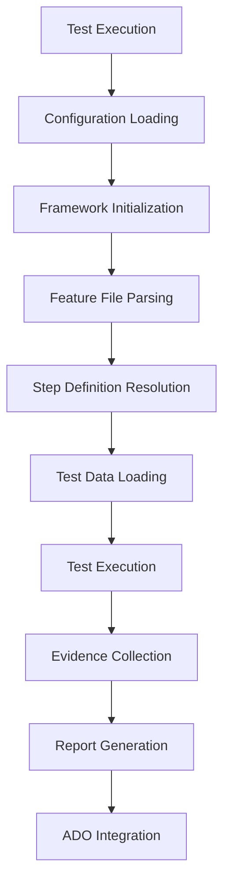

# CS Test Automation Framework - User Guide

This comprehensive guide provides detailed instructions for implementing and using the CS Test Automation Framework with real-world examples.

## 📋 Table of Contents

1. [Framework Architecture](#framework-architecture)
2. [Project Setup](#project-setup)
3. [Configuration Management](#configuration-management)
4. [Test Implementation](#test-implementation)
5. [Data-Driven Testing](#data-driven-testing)
6. [Advanced Features](#advanced-features)
7. [Azure DevOps Integration](#azure-devops-integration)
8. [Best Practices](#best-practices)
9. [Troubleshooting](#troubleshooting)

## Framework Architecture

### Core Components

```
┌─────────────────────────────────────────────────────────┐
│                 CS Framework Core                       │
├─────────────────────────────────────────────────────────┤
│  🎯 BDD Engine    │  🤖 AI Healing   │  📊 Reporting    │
│  • Gherkin Parser │  • Smart Locators │  • Multi-format  │
│  • Step Registry  │  • Auto Recovery  │  • Analytics     │
│  • Test Runner    │  • Visual AI      │  • Dashboards    │
├─────────────────────────────────────────────────────────┤
│  🌐 UI Testing   │  🔗 API Testing   │  🗄️ DB Testing   │
│  • Page Objects   │  • HTTP Client    │  • SQL Queries   │
│  • Element Cache  │  • Response Val.  │  • Multi-DB      │
│  • Browser Pool   │  • Auth Support   │  • Data Val.     │
│  • Cross-Domain   │  • OAuth/JWT      │  • Transactions  │
├─────────────────────────────────────────────────────────┤
│  📦 Data Layer   │  ⚙️ Config Mgmt   │  🔧 Utilities    │
│  • Multi-format  │  • Hierarchical   │  • Logging       │
│  • Caching       │  • Environment    │  • Encryption    │
│  • Streaming     │  • Validation     │  • Network       │
└─────────────────────────────────────────────────────────┘
```

### Framework Flow



## Project Setup

### 1. Environment Configuration

Create a hierarchical configuration structure for your project:

```bash
config/
├── global.env                    # Global framework settings
├── akhan/                       # Project configuration
│   ├── project.env              # Project-specific settings
│   ├── common/                  # Shared configurations
│   │   ├── api.endpoints.env    # API endpoint definitions
│   │   ├── database.queries.env # Database query templates
│   │   └── akhan-common.env     # Common application settings
│   └── environments/            # Environment-specific settings
│       ├── dev.env              # Development environment
│       ├── sit.env              # System Integration Testing
│       ├── qa.env               # Quality Assurance
│       └── uat.env              # User Acceptance Testing
```

### 2. Project Configuration Example

#### config/akhan/project.env
```bash
# Project Metadata
PROJECT_NAME=AKHAN
PROJECT_CODE=AKH
PROJECT_VERSION=2.1.0
PROJECT_DESCRIPTION=AKHAN Application Test Automation Suite

# Default Browser Configuration
DEFAULT_BROWSER=chromium
DEFAULT_HEADLESS=false
DEFAULT_VIEWPORT_WIDTH=1920
DEFAULT_VIEWPORT_HEIGHT=1080

# Test Configuration
DEFAULT_TIMEOUT=30000
DEFAULT_RETRY_COUNT=2
DEFAULT_PARALLEL_WORKERS=1

# Reporting Configuration
REPORT_TITLE=AKHAN Test Execution Report
REPORT_LOGO_URL=https://company.com/logo.png
REPORT_COMPANY=MyCompany Ltd.
```

#### config/akhan/environments/dev.env
```bash
# AKHAN Development Environment Configuration

# Application URLs
AKHAN_URL=https://akhan-ui-dev.mycompany.com/
AKHAN_API_URL=https://api-dev.akhan.com
AKHAN_ADMIN_URL=https://admin-dev.akhan.com

# Test Accounts
ADMIN_USERNAME=admin@akhan.com
ADMIN_PASSWORD=AdminPass@2024
STANDARD_USER=testuser@akhan.com
STANDARD_PASSWORD=TestPass@2024

# Database Configuration
AKHAN_DB_HOST=dev-db.akhan.com
AKHAN_DB_PORT=1433
AKHAN_DB_NAME=AKHAN_DEV
AKHAN_DB_USERNAME=akhan_test_user
AKHAN_DB_PASSWORD=DevDbPass@2024
AKHAN_DB_SCHEMA=dbo

# API Configuration
API_BASE_URL=https://api-dev.akhan.com
API_VERSION=v1
API_TIMEOUT=30000
API_RETRY_ATTEMPTS=3

# Feature Flags
ENABLE_SCREENSHOTS=true
ENABLE_VIDEO_RECORDING=false
ENABLE_TRACING=true
ENABLE_PERFORMANCE_MONITORING=true

# ADO Integration
ADO_ORGANIZATION=mycompany
ADO_PROJECT=akhan-project
ADO_TEST_PLAN_ID=500
ADO_TEST_SUITE_ID=501
ADO_INTEGRATION_ENABLED=true
```

## Configuration Management

### Hierarchical Configuration System

The framework uses a powerful 4-tier configuration hierarchy:

```
┌─────────────────────────────────────────────────────────┐
│                   Configuration Flow                     │
├─────────────────────────────────────────────────────────┤
│  1. Global (config/global.env)                          │
│     ↓ (Base defaults)                                   │
│  2. Project Common (config/{project}/common/)           │
│     ↓ (Project-specific overrides)                      │
│  3. Environment (config/{project}/environments/*.env)   │
│     ↓ (Environment-specific overrides)                  │
│  4. Runtime (CLI arguments / tags)                      │
│     (Highest priority)                                  │
└─────────────────────────────────────────────────────────┘
```

### Configuration Best Practices

1. **Global Settings**: Framework-wide defaults that rarely change
2. **Project Common**: Shared settings across all environments for a project
3. **Environment Specific**: Environment-specific URLs, credentials, and settings
4. **Runtime**: Command-line overrides for special test runs

### Accessing Configuration Values

```typescript
import { ConfigurationManager } from '../core/configuration/ConfigurationManager';

// Get a configuration value
const baseUrl = ConfigurationManager.get('BASE_URL');
const timeout = ConfigurationManager.getInt('DEFAULT_TIMEOUT', 30000);
const isEnabled = ConfigurationManager.getBoolean('ENABLE_SCREENSHOTS', true);

// Set runtime values
ConfigurationManager.set('SESSION_TOKEN', 'abc123');
```

## Test Implementation

### 1. Feature Files

#### Basic Structure
```gherkin
@project:akhan @module:authentication
Feature: User Authentication
  As a user of the AKHAN system
  I want to authenticate securely
  So that I can access my authorized resources

  Background:
    Given I am on the AKHAN login page

  @smoke @priority:critical @TestCaseId-101
  Scenario: Successful login with valid credentials
    When I enter username "admin@akhan.com"
    And I enter password "ValidPass123"
    And I click on the "Login" button
    Then I should be redirected to the dashboard
    And I should see welcome message "Welcome, Admin"
```

#### Data-Driven Scenarios
```gherkin
@regression @TestPlanId-500 @TestSuiteId-501
@DataProvider(source="test/akhan/data/users.json",type="json",jsonPath="$.validUsers[?(@.active==true)]")
Feature: Multi-User Authentication Tests

  Scenario Outline: Login with different user roles
    Given I am on the login page
    When I login with username "<username>" and password "<password>"
    Then I should see the dashboard for role "<role>"
    And I should have access to "<modules>"

    Examples:
      | username | password | role | modules |
```

### 2. Page Object Implementation

#### Base Page Setup
```typescript
import { CSBasePage } from '../../../src/core/pages/CSBasePage';
import { CSGetElement } from '../../../src/core/elements/decorators/CSGetElement';
import { CSWebElement } from '../../../src/core/elements/CSWebElement';

export class LoginPage extends CSBasePage {
    pageUrl = '/login';
    pageName = 'AKHAN Login Page';

    // Element Definitions with AI Healing
    @CSGetElement({
        locatorType: 'css',
        locatorValue: '#username',
        description: 'Username input field',
        waitConditions: { state: 'visible', timeout: 10000 },
        healingStrategies: ['ai-text', 'ai-position']
    })
    private usernameInput!: CSWebElement;

    @CSGetElement({
        locatorType: 'css',
        locatorValue: '#password',
        description: 'Password input field',
        isSensitive: true // Automatically masks in logs
    })
    private passwordInput!: CSWebElement;

    @CSGetElement({
        locatorType: 'css',
        locatorValue: 'button[type="submit"]',
        description: 'Login submit button',
        fallbackLocators: [
            'text=Login',
            'button:has-text("Sign In")',
            '//button[contains(@class, "login-btn")]'
        ]
    })
    private loginButton!: CSWebElement;

    // Page Methods
    async login(username: string, password: string): Promise<void> {
        await this.usernameInput.fill(username);
        await this.passwordInput.fill(password);
        await this.loginButton.click();
        
        // Wait for navigation - framework handles cross-domain redirects automatically
        await this.page.waitForLoadState('networkidle');
    }

    async verifyLoginError(expectedError: string): Promise<void> {
        const errorElement = await this.page.locator('.error-message');
        await expect(errorElement).toContainText(expectedError);
    }
}
```

### 3. Step Definition Implementation

```typescript
import { CSBDDBaseStepDefinition } from '../../../src/bdd/base/CSBDDBaseStepDefinition';
import { CSBDDStepDef, StepDefinitions } from '../../../src/bdd/decorators/CSBDDStepDef';
import { LoginPage } from '../pages/LoginPage';
import { DashboardPage } from '../pages/DashboardPage';

@StepDefinitions
export class AuthenticationSteps extends CSBDDBaseStepDefinition {
    private loginPage!: LoginPage;
    private dashboardPage!: DashboardPage;

    async before() {
        // Initialize page objects
        this.loginPage = new LoginPage();
        this.dashboardPage = new DashboardPage();
        
        await this.loginPage.initialize(this.page);
        await this.dashboardPage.initialize(this.page);
    }

    @CSBDDStepDef('I am on the AKHAN login page')
    async navigateToLoginPage() {
        await this.loginPage.navigateTo();
        await this.loginPage.waitForPageLoad();
    }

    @CSBDDStepDef('I enter username {string}')
    async enterUsername(username: string) {
        // Runtime property storage example
        this.bddContext.store('currentUsername', username);
        await this.loginPage.enterUsername(username);
    }

    @CSBDDStepDef('I enter password {string}')
    async enterPassword(password: string) {
        await this.loginPage.enterPassword(password);
    }

    @CSBDDStepDef('I click on the {string} button')
    async clickButton(buttonText: string) {
        await this.page.click(`button:has-text("${buttonText}")`);
    }

    @CSBDDStepDef('I should be redirected to the dashboard')
    async verifyDashboardRedirect() {
        await this.dashboardPage.waitForPageLoad();
        const url = this.page.url();
        expect(url).toContain('/dashboard');
    }

    @CSBDDStepDef('I should see welcome message {string}')
    async verifyWelcomeMessage(expectedMessage: string) {
        const actualMessage = await this.dashboardPage.getWelcomeMessage();
        
        // Use built-in assertion with automatic logging
        this.assertEquals(actualMessage, expectedMessage, 'Welcome message verification');
        
        // Or use ActionLogger for custom verification logging
        await ActionLogger.logVerification(
            'Welcome message displayed correctly',
            expectedMessage,
            actualMessage,
            actualMessage === expectedMessage
        );
        
        // Retrieve stored username
        const username = this.bddContext.retrieve<string>('currentUsername');
        console.log(`User ${username} successfully logged in`);
    }
}
```

## Data-Driven Testing

### 1. JSON Data Provider

#### Test Data Structure (test/akhan/data/test-data.json)
```json
{
  "validUsers": [
    {
      "testId": "TC001",
      "username": "admin@akhan.com",
      "password": "Admin123",
      "role": "admin",
      "modules": ["dashboard", "users", "settings", "reports"],
      "active": true,
      "executeFlag": true
    },
    {
      "testId": "TC002",
      "username": "user@akhan.com",
      "password": "User123",
      "role": "standard",
      "modules": ["dashboard", "reports"],
      "active": true,
      "executeFlag": true
    }
  ],
  "invalidUsers": [
    {
      "testId": "TC003",
      "username": "invalid@akhan.com",
      "password": "wrong",
      "expectedError": "Invalid credentials",
      "executeFlag": true
    }
  ]
}
```

### 2. Excel Data Provider

#### Excel Structure
- **Sheet: TestData**
  - Columns: TestCase, Username, Password, ExpectedResult, ExecuteFlag
- **Sheet: ValidationRules**
  - Columns: RuleName, Condition, ExpectedBehavior

#### Usage in Feature Files
```gherkin
@DataProvider(source="test/akhan/data/users.xlsx",type="excel",sheetName="TestData",filter="ExecuteFlag=Y")
Scenario Outline: Excel data-driven login test
  Given I am on the login page
  When I login with username "<Username>" and password "<Password>"
  Then I should see result "<ExpectedResult>"
```

### 3. CSV Data Provider

```gherkin
@DataProvider(source="test/akhan/data/users.csv",type="csv",delimiter=",",headers="true")
Scenario Outline: CSV data-driven test
  Given I navigate to "<Module>"
  When I perform action "<Action>"
  Then I verify outcome "<Expected>"
```

### 4. Column Normalization

The framework automatically handles column name variations:

| Original Column Names | Normalized To |
|----------------------|---------------|
| testId, testCaseId, tcId, tc_id | testCase |
| user, userName, login, user_name | username |
| pass, passwd, pwd, password | password |
| executeTest, run, active, execute_flag | executeFlag |
| menu, menuItem, section, module_name | module |

### 5. Advanced Data Provider Features

#### JSONPath Filtering
```gherkin
@DataProvider(source="data.json",type="json",jsonPath="$.users[?(@.role=='admin' && @.active==true)]")
```

#### Multiple Filters
```gherkin
@DataProvider(source="data.xlsx",type="excel",filter="priority=high,status=active,executeFlag=Y")
```

#### Skip Execution Flag
```gherkin
# Include all rows regardless of executeFlag
@DataProvider(source="data.xlsx",type="excel",skipExecutionFlag="true")
```

## Advanced Features

### 1. Enhanced Action Logging

The framework provides comprehensive action logging with automatic value capture and secret masking:

#### Features
- **Verbose Descriptions**: Every action shows what happened with actual values
- **Automatic Secret Masking**: Sensitive fields are automatically masked
- **Exception Details**: Failed actions include error messages
- **Performance Metrics**: Duration tracking for each action
- **Verification Logging**: All assertions automatically logged with expected vs actual values
- **Navigation Tracking**: Complete visibility into page navigations and wait conditions

#### Example Log Output
```
Step: Login to application
  ├─ [00:01.234] ✓ Element filled: 'admin@akhan.com' filled in Username input field (145ms)
  ├─ [00:01.380] ✓ Element filled: '********' filled in Password input field (89ms)
  ├─ [00:01.469] ✓ Element clicked: Login submit button (234ms)
  └─ [00:02.726] ✓ Page navigated: Dashboard loaded successfully (1257ms)
```

#### Custom Action Logging
```typescript
import { ActionLogger } from '../../../src/core/logging/ActionLogger';

// Log custom business actions
await ActionLogger.logInfo('Processing order checkout', {
    orderId: 'ORD-12345',
    amount: 99.99,
    status: 'completed'
});

// Log verification results
await ActionLogger.logVerification(
    'Order total validation',
    99.99,  // expected
    99.99,  // actual
    true    // passed
);
```

### 2. Console Log Capture

All terminal console output is automatically captured and integrated into reports:

#### What's Captured
- `console.log()` - General logs
- `console.error()` - Error messages
- `console.warn()` - Warnings
- `console.debug()` - Debug information
- `console.info()` - Information messages

#### Report Integration
- Logs are categorized by type
- Filterable in HTML reports
- Searchable across all entries
- Timestamps for each log entry

### 3. Runtime Property Storage

#### ConfigurationManager (Global Storage)
```typescript
// Store runtime values
ConfigurationManager.set('API_TOKEN', response.token);
ConfigurationManager.set('USER_ID', userId);

// Retrieve anywhere in the test
const token = ConfigurationManager.get('API_TOKEN');
const userId = ConfigurationManager.get('USER_ID');
```

#### BDDContext (Scoped Storage)
```typescript
// Store with different scopes
this.bddContext.store('tempValue', data, 'step');      // Step only
this.bddContext.store('scenarioData', data, 'scenario'); // Entire scenario
this.bddContext.store('featureData', data, 'feature');   // Entire feature
this.bddContext.store('globalData', data, 'world');      // All tests

// Retrieve with type safety
const data = this.bddContext.retrieve<MyType>('scenarioData');
```

#### ExecutionContext (Session Storage)
```typescript
// Store session metadata
this.executionContext.setMetadata('testRunId', 'TR-12345');
this.executionContext.setMetadata('environment', 'qa');

// Retrieve metadata
const runId = this.executionContext.getMetadata('testRunId');
```

### 4. Parallel Execution

Configure parallel test execution for better performance:

```typescript
// playwright.config.ts
export default defineConfig({
    workers: process.env.CI ? 2 : undefined,
    fullyParallel: true,
    use: {
        trace: 'on-first-retry',
        screenshot: 'only-on-failure'
    }
});
```

Environment variables:
```env
MAX_PARALLEL_WORKERS=4
PARALLEL_SCENARIO_EXECUTION=true
WORKER_POOL_SIZE=auto
```

### 5. Cross-Domain Navigation

The framework automatically handles complex authentication flows:

#### Supported Scenarios
- Single Sign-On (SSO) redirects
- NetScaler authentication
- OAuth/SAML flows
- Multi-domain applications

#### Configuration
```env
# Enable cross-domain navigation handling
CROSS_DOMAIN_NAVIGATION_ENABLED=true
AUTH_DOMAIN_PATTERNS=login.company.com,auth.company.com
APP_DOMAIN=app.company.com

# CSP-safe mode for restricted environments
CSP_SAFE_MODE=true
```

#### Usage
```typescript
// Framework automatically handles redirects
await this.loginPage.navigateTo();
// Even if URL redirects to NetScaler -> App, it's handled seamlessly

// Built-in wait methods with logging
await this.waitForURL(/dashboard/, { timeout: 30000 });
await this.waitForLoadState('networkidle');
```

### 6. Network Interception

#### Mock API Responses
```typescript
await this.page.route('**/api/users', route => {
    route.fulfill({
        status: 200,
        contentType: 'application/json',
        body: JSON.stringify({
            users: [
                { id: 1, name: 'Test User', role: 'admin' }
            ]
        })
    });
});
```

#### Simulate Network Conditions
```typescript
// Simulate slow 3G
await this.page.route('**/*', route => {
    route.continue({ delay: 500 });
});

// Block specific resources
await this.page.route('**/*.png', route => route.abort());
```

### 7. Performance Monitoring

#### Collect Web Vitals
```typescript
const metrics = await this.page.evaluate(() => ({
    lcp: performance.getEntriesByName('largest-contentful-paint')[0]?.startTime,
    fid: performance.getEntriesByName('first-input')[0]?.processingStart,
    cls: performance.getEntriesByType('layout-shift')
        .filter((e: any) => !e.hadRecentInput)
        .reduce((sum, e: any) => sum + e.value, 0)
}));

// Verify against budgets
expect(metrics.lcp).toBeLessThan(2500); // 2.5s
expect(metrics.cls).toBeLessThan(0.1);  // 0.1
```

### 8. Database Integration

```typescript
@CSBDDStepDef('I verify data in database')
async verifyDatabaseData() {
    const dbClient = await this.getDatabaseClient('AKHAN_DB');
    
    const query = `
        SELECT id, username, status
        FROM users 
        WHERE email = @email
        AND status = 'ACTIVE'
    `;
    
    const results = await dbClient.executeQuery(query, {
        email: 'admin@akhan.com'
    });
    
    expect(results.length).toBeGreaterThan(0);
    expect(results[0].status).toBe('ACTIVE');
}
```

### 9. Assertion and Verification Logging

All assertions in the framework automatically log their results:

#### Built-in Assertion Methods
```typescript
// All these methods automatically log to reports
this.assert(condition, 'Validation message');
this.assertEquals(actual, expected, 'Values should match');
this.assertContains(text, substring, 'Text validation');
this.assertMatches(text, /pattern/, 'Pattern validation');
this.assertTrue(condition, 'Should be true');
this.assertFalse(condition, 'Should be false');
this.assertNotNull(value, 'Should not be null');
this.assertArrayContains(array, item, 'Array validation');
this.assertInRange(value, min, max, 'Range validation');
this.softAssert(condition, 'Non-failing assertion');
```

#### Custom Verification Logging
```typescript
// Log any custom verification
await ActionLogger.logVerification(
    'Custom business rule validation',
    expectedValue,
    actualValue,
    passed
);
```

#### Report Output
```
Verification Passed: Order total validation
  Expected: 99.99
  Actual: 99.99
  Status: ✓ Passed
  
Verification Failed: User role check  
  Expected: "admin"
  Actual: "user"
  Status: ✗ Failed
```

### 10. AI-Powered Features (In Progress)

#### Self-Healing Locators
```typescript
@CSGetElement({
    locatorType: 'css',
    locatorValue: '#dynamic-button',
    healingStrategies: [
        'ai-visual',      // Visual pattern recognition
        'ai-text',        // Text-based identification
        'ai-position',    // Relative position analysis
        'ai-semantic'     // Semantic understanding
    ],
    healingConfig: {
        maxAttempts: 3,
        confidenceThreshold: 0.8
    }
})
private dynamicButton!: CSWebElement;
```

> Note: AI features are currently under development and testing

## Azure DevOps Integration

### Overview

The framework provides enterprise-grade integration with Azure DevOps Test Plans, enabling automatic test result publishing, evidence attachment, and test case management.

### Architecture

```
ADOIntegrationService (Main orchestrator)
    ├── ADOClient (HTTP communication)
    ├── ADOConfig (Configuration management)
    ├── TestRunManager (Test run lifecycle)
    ├── TestResultUploader (Result uploads)
    ├── EvidenceUploader (Attachment handling)
    └── ADOTagExtractor (Tag parsing)
```

### Tag-Based Test Mapping

Map scenarios to Azure DevOps test artifacts using tags:

```gherkin
@TestPlanId-100 @TestSuiteId-200
Feature: User Management

  @TestCaseId-12345 @priority:critical
  Scenario: Create new user
    Given I am logged in as admin
    When I create a user with email "test@example.com"
    Then the user should be created successfully
```

### Supported Tags

| Tag Format | Description | Example |
|------------|-------------|---------|
| `@TestCaseId-XXX` | Maps to ADO test case | `@TestCaseId-12345` |
| `@TestPlanId-XXX` | Specifies test plan | `@TestPlanId-100` |
| `@TestSuiteId-XXX` | Specifies test suite | `@TestSuiteId-200` |
| `@priority:level` | Sets test priority | `@priority:critical` |

### Priority Mapping

- `@priority:critical` → ADO Priority 1
- `@priority:high` → ADO Priority 2
- `@priority:medium` → ADO Priority 3 (default)
- `@priority:low` → ADO Priority 4

### Configuration

```env
# Core Settings
ADO_INTEGRATION_ENABLED=true
ADO_ORGANIZATION_URL=https://dev.azure.com/yourorg
ADO_PROJECT_NAME=YourProject
ADO_API_VERSION=7.0

# Authentication
ADO_PAT_TOKEN=ENCRYPTED:U2FsdGVkX1+...

# Test Configuration
ADO_TEST_PLAN_ID=100
ADO_TEST_SUITE_ID=200

# Upload Settings
ADO_UPLOAD_BATCH_SIZE=50
ADO_UPLOAD_TIMEOUT=300000
ADO_RETRY_COUNT=3

# Evidence Settings
ADO_UPLOAD_SCREENSHOTS=true
ADO_UPLOAD_VIDEOS=true
ADO_UPLOAD_LOGS=true
ADO_ATTACHMENT_MAX_SIZE=10485760
ADO_COMPRESS_ATTACHMENTS=true

# Bug Creation
ADO_AUTO_CREATE_BUG=true
ADO_BUG_ASSIGN_TO=user@company.com
ADO_BUG_AREA_PATH=YourProject\\QA

# Build Integration
ADO_BUILD_ID=${BUILD_BUILDID}
ADO_BUILD_NUMBER=${BUILD_BUILDNUMBER}
```

### Evidence Attachment

| Type | Extensions | Compression | Chunked Upload |
|------|------------|-------------|----------------|
| Screenshots | .png, .jpg | Auto (>1MB) | No |
| Videos | .mp4, .webm | No | Yes |
| Logs | .log, .txt | Auto (>5MB) | No |
| Reports | .html → .zip | Always | Yes |

### Advanced Usage

#### Multi-Environment Testing
```gherkin
@TestPlanId-100
Feature: Cross-Browser Testing

  @TestCaseId-5001 @browser:chrome @env:qa
  Scenario: Chrome - User login
    Given I am testing on Chrome
    When I perform login
    Then I verify success

  @TestCaseId-5001 @browser:firefox @env:qa
  Scenario: Firefox - User login
    Given I am testing on Firefox
    When I perform login
    Then I verify success
```

#### Conditional Bug Creation
```env
ADO_AUTO_CREATE_BUG=true
ADO_BUG_CREATION_FILTER=@priority:critical,@priority:high
ADO_BUG_SEVERITY=2 - High
```

## Best Practices

### 1. Test Organization

```
test/akhan/
├── features/              # Feature files by module
│   ├── authentication/   
│   ├── user-management/  
│   └── reporting/        
├── pages/                # Page objects
│   ├── common/          
│   └── modules/         
├── steps/               # Step definitions
│   ├── common/          
│   └── domain-specific/ 
└── data/                # Test data
    ├── users/           
    └── test-cases/      
```

### 2. Page Object Pattern

- One page object per logical page/component
- Encapsulate element locators
- Provide meaningful method names
- Handle waits and validations internally

### 3. Step Definition Guidelines

- Keep steps atomic and focused
- Use parameters for reusability
- Avoid implementation details in step text
- Group related steps in single class

### 4. Data Management

- Externalize test data
- Use meaningful data file names
- Version control test data
- Encrypt sensitive information

### 5. Configuration Management

- Use environment variables for secrets
- Maintain separate configs per environment
- Document all configuration options
- Use hierarchical overrides wisely

### 6. Error Handling

```typescript
try {
    await this.performAction();
} catch (error) {
    // Capture evidence
    await this.page.screenshot({ 
        path: `errors/error-${Date.now()}.png` 
    });
    
    // Log error details
    await ActionLogger.logError('Failed to perform action', error);
    
    throw error; // Re-throw for test failure
}
```

## Troubleshooting

### Common Issues and Solutions

#### 1. Element Not Found
**Issue**: Element locator fails to find element
**Solutions**:
- Check if element is in iframe
- Verify element is visible/enabled
- Add appropriate wait conditions
- Use more specific locators
- Enable AI healing strategies

#### 2. Timeout Errors
**Issue**: Tests timeout waiting for elements/navigation
**Solutions**:
- Increase timeout values
- Use proper wait conditions
- Check network throttling
- Verify page load state
- For CSP errors, enable CSP_SAFE_MODE=true

#### 3. Data Provider Issues
**Issue**: Data not loading from external files
**Solutions**:
- Verify file path is correct
- Check data format matches provider type
- Ensure column names are normalized
- Validate filter expressions

#### 4. Cross-Domain Navigation Issues
**Issue**: Tests fail during SSO/NetScaler authentication
**Solutions**:
- Enable CROSS_DOMAIN_NAVIGATION_ENABLED=true
- Configure AUTH_DOMAIN_PATTERNS with auth domains
- Use CSP_SAFE_MODE=true for restricted environments
- Let framework handle redirects automatically

#### 5. Configuration Not Loading
**Issue**: Environment variables not being picked up
**Solutions**:
- Check configuration hierarchy
- Verify file naming conventions
- Ensure proper .env file format
- Check for typos in variable names

#### 6. ADO Integration Failures
**Issue**: Test results not uploading to Azure DevOps
**Solutions**:
- Verify PAT token permissions
- Check test case IDs exist
- Ensure proper tag format
- Validate network connectivity

### Debug Mode

Enable debug mode for detailed logging:
```bash
# Via command line
npm run test -- --debug=true

# Via environment variable
DEBUG_MODE=true npm run test

# In code
process.env.DEBUG_MODE = 'true';
```

### Performance Optimization

1. **Use Parallel Execution**: Run tests in parallel when possible
2. **Optimize Locators**: Use efficient CSS selectors
3. **Minimize Waits**: Use smart waits instead of fixed delays
4. **Cache Data**: Reuse test data across scenarios
5. **Clean Up Resources**: Properly close browsers and connections

---

This comprehensive user guide provides practical implementation guidance for the CS Test Automation Framework, demonstrating its enterprise-grade capabilities for zero-code test automation.